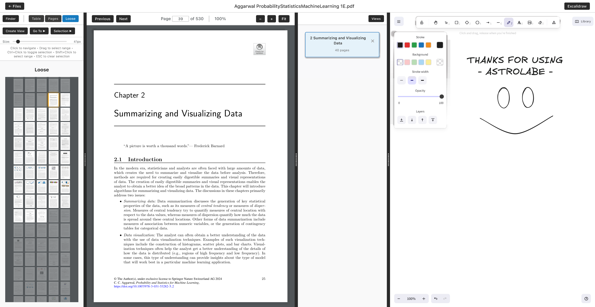

# Astrolabe

A PDF Reader for efficient workflow with Excalidraw

## Node Package Manager Installation

---

#### Windows (PowerShell)

    winget install OpenJS.NodeJS.LTS
    node --version
    npm --version

---

#### macOS (Terminal)

    /bin/bash -c "$(curl -fsSL https://raw.githubusercontent.com/Homebrew/install/HEAD/install.sh)"
    brew install node
    node --version
    npm --version

---

#### Linux (Ubuntu/Debian – Terminal)

    curl -fsSL https://deb.nodesource.com/setup_20.x | sudo -E bash -
    sudo apt-get install -y nodejs
    node --version
    npm --version

---

## Web Application Initialization

    git clone https://github.com/AhmedKhan-GH/astrolabe
    cd astrolabe
    npm install
    npm run dev

## Astrolabe Example
